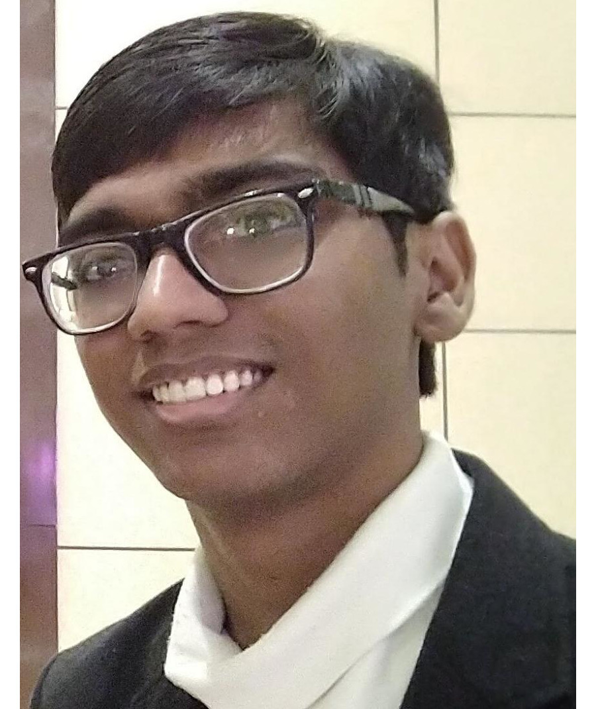

---
#
# By default, content added below the "---" mark will appear in the home page
# between the top bar and the list of recent posts.
# To change the home page layout, edit the _layouts/home.html file.
# See: https://jekyllrb.com/docs/themes/#overriding-theme-defaults
#
layout: page
---

Hello World!

My name is Sarthak Consul, and I'm a senior undergraduate at <a href="http://iitb.ac.in/" target="_blank">IIT Bombay</a> majoring in Electrical Engineering with a minor in Computer Science and Engineering. I intend to use this little corner of the internet to give an peek into my mind and share my work experience. 

You can read more about me [here](/about).

You can see my CV [here](/assets/CV.pdf). (Updated in Dec'19)

Click [here](/research) to know about my research in detail.

I maintain a detailed list of my projects [here](/projects).

<h2 id="updates">News</h2>
<ul id="news">
 <li> <i> Dec. 2019</i>: Pre-print of our paper on the lower bounds of simple policy iteration is available on <a href="https://arxiv.org/abs/1911.12842" target="_blank">arXiv</a> </li>
<li> <i> Jun. 2019</i>: I will be interning at the Institute of Biomechanics, ETH Zürich.</li>
<li> <i> May 2019</i>: The grades for Spring'19 are out and I have scored a perfect 10 securing AA grades in all courses! </li>
 <li> <i> Apr. 2019</i>: We presented DPAC: A hybrid computer for Hardware In Loop (HIL) simulations at the EDL demo session.  </li>
 <li> <i> May 2018</i>: I will be interning at the Medical Deep Learning and Artificial Intelligence Lab (MeDAL), IIT Bombay, India. </li>
</ul>
 

