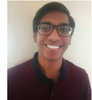

---
#
# By default, content added below the "---" mark will appear in the home page
# between the top bar and the list of recent posts.
# To change the home page layout, edit the _layouts/home.html file.
# See: https://jekyllrb.com/docs/themes/#overriding-theme-defaults
#
layout: page
---

Hello World!
<!--

My name is Sarthak Consul, and I have recently graduated from <a href="http://iitb.ac.in/" target="_blank">IIT Bombay</a> with a B.Tech (Hons.) in Electrical Engineering along with a minor in Computer Science and Engineering. I will be joining the Masters in <a href="http://cs.stanford.edu/" target="_blank">Computer Science</a> program at <a href="https://stanford.edu/" target="_blank">Stanford University</a> in Fall 2021. I intend to use this little corner of the internet to give a peek into my mind and share my work experience. 

-->

My name is Sarthak Consul, and I am an incoming graduate student at the <a href="http://cs.stanford.edu/" target="_blank">Computer Science</a> department at <a href="https://stanford.edu/" target="_blank">Stanford University</a>. I intend to use this little corner of the internet to give a peek into my mind and share my work experience. 

<!--At IIT Bombay, -->I worked on generative models for transfering singing styles across unpaired music clips with <a href="https://www.ee.iitb.ac.in/~sc/" target="_blank">Prof. Subhasis Chaudhuri</a> as a part of my Bachelor's thesis. I also worked under the guidance of <a href="https://www.ee.iitb.ac.in/~asethi/" target="_blank">Prof. Amit Sethi</a> to develop a Reinforcement Learning based approach for semantic and interactive segmentation. Furthermore, I worked on deriving novel lower bounds on policy iteration for multi-action MDPs under 
<a href="https://www.cse.iitb.ac.in/~shivaram/" target="_blank">Prof. Shivaram Kalyanakrishnan</a>.

In the summer of 2019, I had the opportunity to work with <a href="https://biomech.ethz.ch/research/ralph-mueller.html" target="_blank">Prof. Ralph Müller</a> at the <a href="https://biomech.ethz.ch/" target="_blank">Institute of Biomechanics</a> at ETH Zürich and leveraged deep-learning to segment lacunae from 3D micro-CT scans of trabecular human bone tissue. 

<!-- 

In 2018, I was a student researcher at Medical Deep Learning and AI Lab - IIT Bombay working on using deep-learning for the segmentation of nuclei from various 2D-medical datasets.

 -->
<!-- I maintain a list of my projects and research experience under the [Research](/research) and [Projects](/research) tabs.

To get an insight on my professional life so far, you can have a look at my [CV](/assets/CV.pdf). -->

<h2 id="updates">News</h2>
<ul id="news">
 <li> <i> Apr. 2021</i>: Our journal paper based on a novel single-round pooled testing approach for COVID has been accepted in IEEE Open Journal of Signal Processing. Paper is available <a href="https://ieeexplore.ieee.org/document/9416868" target="_blank">here</a>. </li>
 <li> <i>Apr. 2021</i>: Selected as a Section Leader for <a href="https://codeinplace.stanford.edu/" target="_blank">Code In Place, 2021</a>.</li>
<!--<li> <i> Aug 2020</i>: Graduated from IIT Bombay with a Bachelor's (with Honours) in Electrical Engineering and a minor in Computer Science.</li>-->
<li> <i> July 2020</i>: Our work on Lower bounds for Policy Iteration on Multi-Action MDPs was accepted to IEEE CDC 2020. Paper is available on <a href="https://arxiv.org/abs/2009.07842" target="_blank">arXiv</a>.</li>
 <li> <i> Dec. 2019</i>: Our work on a novel single-round pooled testing approach, called <a href="https://tapestry-pooling.herokuapp.com/" target="_blank">Tapestry</a>, has entered the clinical trial phase, with promising preliminary results. </li>
 <li> <i> Dec. 2019</i>: Pre-print of our paper on the lower bounds of simple policy iteration is out on <a href="https://arxiv.org/abs/1911.12842" target="_blank">arXiv</a> </li>
<li> <i> Jun. 2019</i>: Started summer interniship at the Institute of Biomechanics, ETH Zürich</li>
<!-- <li> <i> May 2019</i>: The grades for Spring'19 are out! Got perfect 10 (AA) in all courses! </li> -->
 <li> <i> Apr. 2019</i>: We presented our hybrid computer, <a href="https://sconsul.github.io/proj/DPAC" target="_blank">DPAC</a>, at the EDL demo session.  </li>
 <!-- <li> <i> May 2018</i>: Interned at the Medical Deep Learning and AI Lab (MeDAL), IIT Bombay, India. </li> -->
</ul>
 

