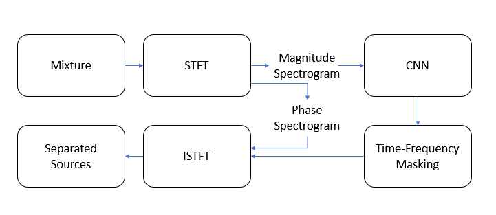
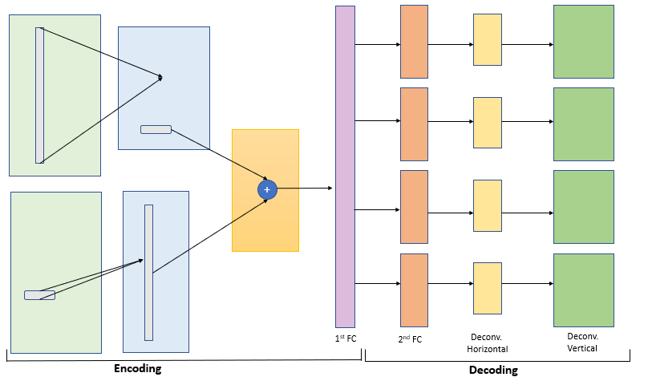

<h3><b> Audio Source Separation </b></h3>

Course Project for CS419 - Introduction to Machine Learning, Autumn 2018

with P. Khirwadkar, A. Prasad and D. Gopalan

[[Code]](https://github.com/SConsul/audio-source-separation){:target="\_blank"}

The project aimed to isolate the various instruments playing in harmony in a music track. To do this, our approach was to train a low-latency neural network to generate the short-time Fourier Transforms (STFTs) of the various component instruments from the magnitude spectrum of the audio track. Our aproach is inspired by the paper titled, "[Monoaural Audio Source Separation Using Deep Convolutional Neural Networks](https://link.springer.com/chapter/10.1007%2F978-3-319-53547-0_25){:target="\_blank"}". 

<em>Overview of Algorithm</em>

In a bid to reduce the number of parameters in the network, depthwise convolution filters were used. The horizontal and vertical convolutions were incorporated in manner similar to the GCN blocks introduced in [this](https://arxiv.org/abs/1703.02719) paper.

<em>Our Neural Network</em>

<!--For this project, we used [Demixing Secrets Dataset 100 (DSD100)](https://sigsep.github.io/datasets/dsd100.html){:target="\_blank"} for training and testing purposes. -->
