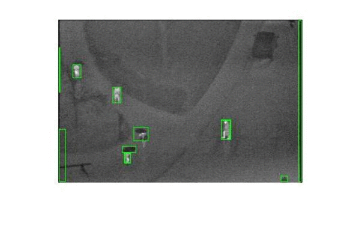
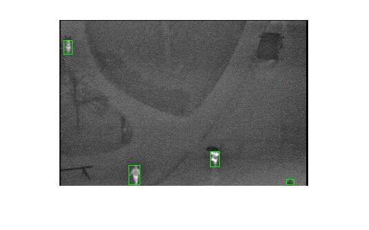
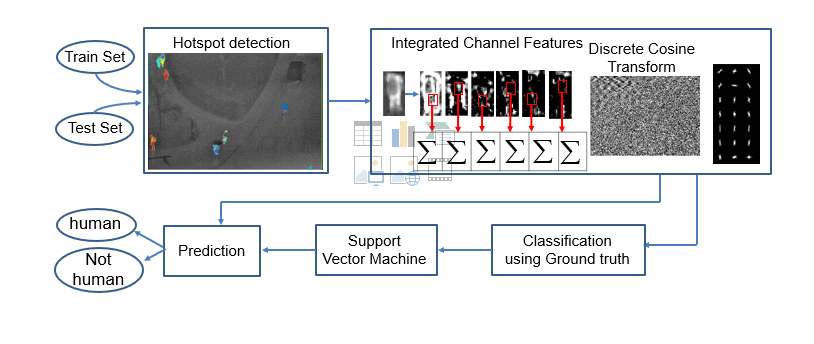

<h3><b>Human Detection from Post-disaster LWIR Imagery</b></h3>

Course Project for EE338 - Digital Signal Processing, Spring 2019

with P. Khirwadkar, B. Dedhia and K. Porlikar

[[Code]](https://github.com/SConsul/Human-Detction-from-LWIR-Images){:target="\_blank"}

  
   

LWIR imagery is desirable compared to conventional light imaging owing to robustness against occlusion and illumination variation. The aim of this project was to build a human detection tool for LWIR imagery to enable drone based reconnaissance and achieve safer and faster rescue.

The pipeline of the tool was as follows:

- Compute the hotspot regions by calculating Maximally Stable Extremal regions (MSER)

- Resize the hotspots to a fixed dimension and extract Histogram of gradients, Integrated Channel features and Discrete Cosine transform to build a 2000 feature vector

- A support vector machine is trained on the groundtruth vectors containing labelled hotspots to detect humans.

The tool was trained on the OTCBVS datset. We achieved a 98.79 % test acccuracy against the OTCBVS dataset and the model worked flawlessly for real-world LWIR disaster images containing a considerable amount of obstructions and illumination variance.

<em>Overview of the system</em>

