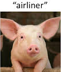
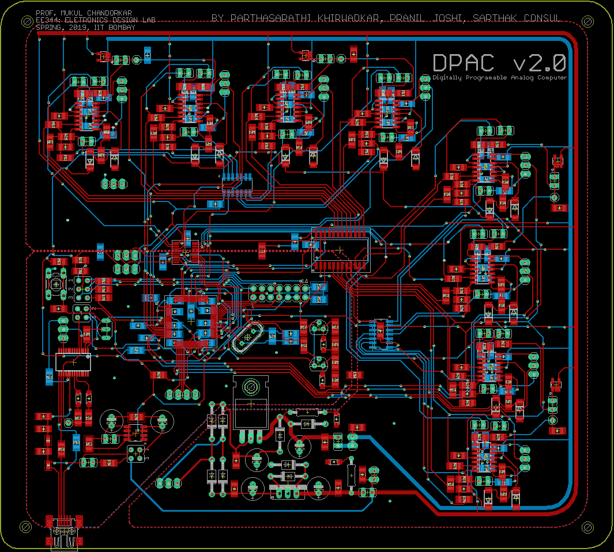
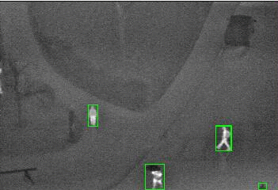
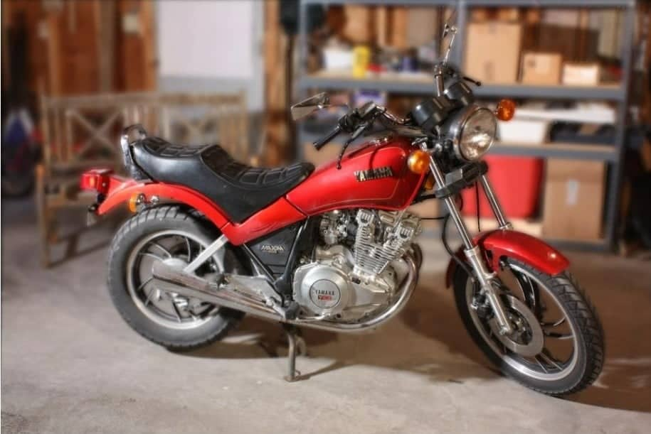
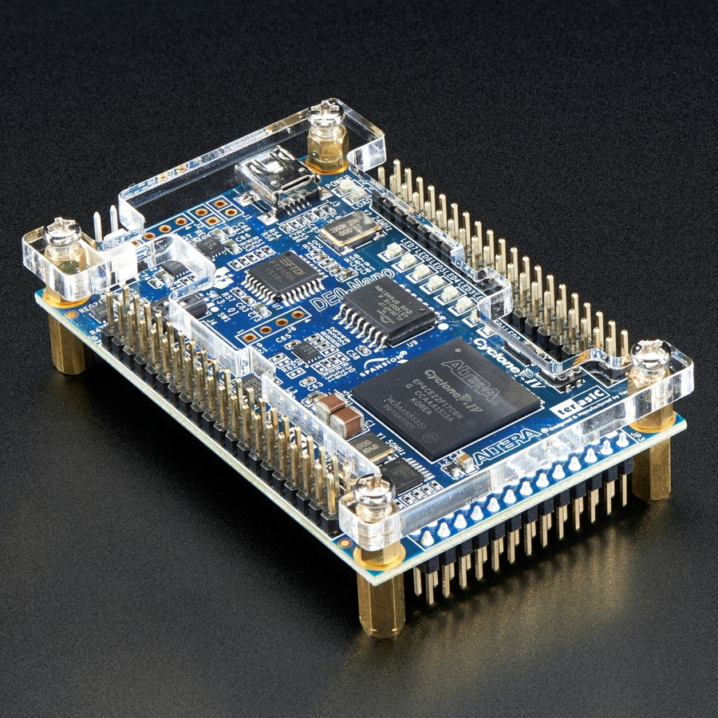
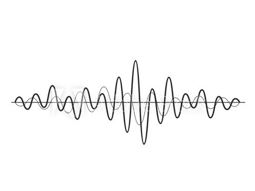
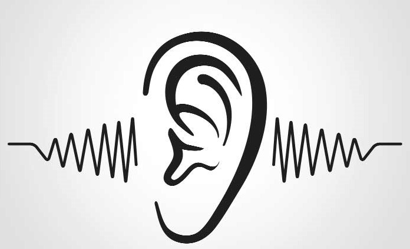

Here is a non-exhaustive list of the major non-research projects I have done as an undergraduate at IIT Bombay. For more projects check my [GitHub profile](https://github.com/sconsul){:target="\_blank"}.

# 2019

<!-- # {:height="15%" width="15%" :class="img-responsive"} [Executing Adversarial Attacks on Neural Networks](/proj/adv_attacks)
 -->
# {:height="15%" width="15%" :class="img-responsive"} [Digitally Programmable Analog Computer](/proj/DPAC)

<!-- # {:height="15%" width="15%" :class="img-responsive"}  [Human Detection from Post-disaster LWIR Imagery](/proj/dsp) -->

# 2018

# {:height="15%" width="15%" :class="img-responsive"} [Depth Estimation and Post Capture Image Refocusing](/proj/dip)

# {:height="15%" width="15%" :class="img-responsive"} [Pipelined and Multicycle Implementation of IITB-RISC ISA](/proj/iitb_risc)

<!-- # {:height="15%" width="15%" :class="img-responsive"} [Low Latency Neural Network for Audio Source Separation](/proj/audio_src_sep) -->

# {:height="15%" width="15%" :class="img-responsive"} [Analog Sound Locator](/proj/sound_loc)

